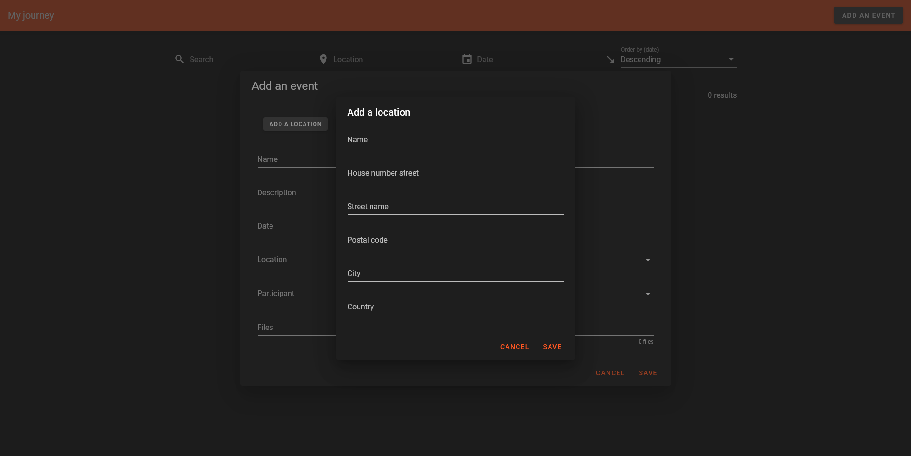

# my-journey

My journey is a web application to memorize interesting events of life (parties, trips...) using a database.

You can create events and associate them with people as well as search for existing events with filters (name, participants, location and date) and sort by date.

Due to a much longer development time than expected and changes of choices during the development, the code and the interface do not fully meet the expectations set at the beginning of the project (but it works).

The project is still in development to include the ability to add files, view events on a map, add NGINX and solve issues.

## Screenshots

### Add an event


### Add a person


### Add a location



### Main view with event selection


## Prerequisites

* python 3.9
* npm 8
* node 16
* pip
* pipenv
* docker
* docker-compose

## Development (Windows 10)

```
git clone https://github.com/Gyskard/my-journey

cd ./my-journey/api
python.exe -m pipenv install
python.exe -m pipenv run serve

cd ./my-journey/front
npm install
npx vue-cli-service serve

cd ./my-journey
docker-compose up
```

## Deployment (Docker)

Not available yet.

## Built With

* VueJS
* Vuetify
* FastAPI
* PostgreSQL
* Docker

## Authors

* **Thomas Margueritat** - *Initial work* - [Gyskard](https://github.com/Gyskard)

## License

This project is licensed under the MIT License - see the [LICENSE.md](LICENSE) file for details